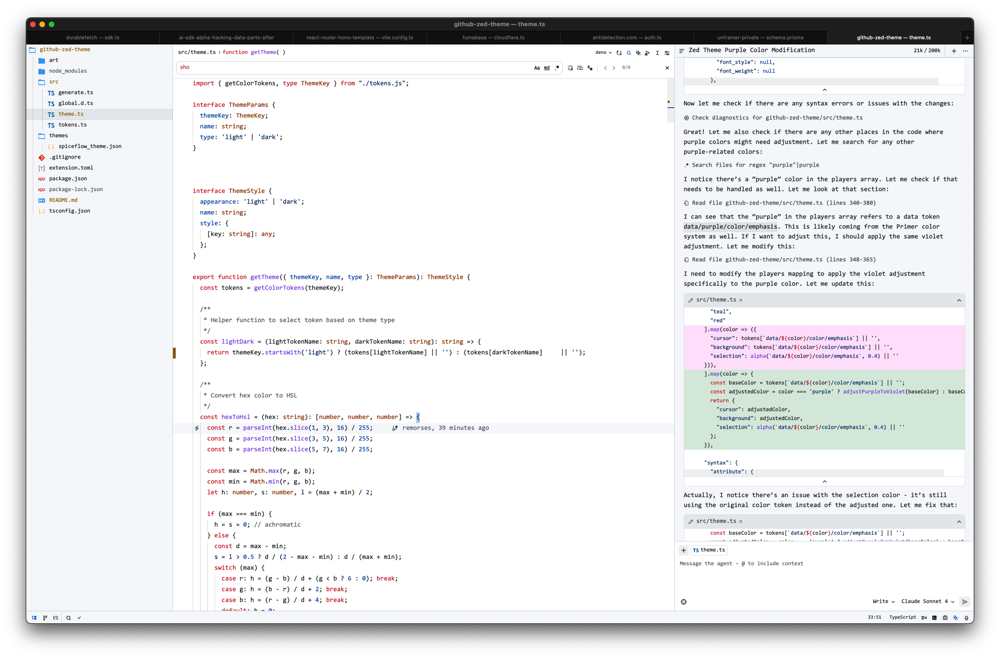

# Spiceflow Zed Themes

Project inspired on [GitHub's VS Code theme](https://github.com/primer/github-vscode-theme). Generated from [Primer's Primitives](https://primer.style/primitives/) with modifications.

Git deletions have been colored purple so you can distinguish errors from deletions in the scrollbar gutters.

### Dark


### Light



## Installation

1. Open `Command Palette`
2. Select `zed: extensions`
3. Search `Spiceflow Theme`

## Activate Theme

1. Open `Command Palette`
2. Select `theme selector: toggle`
3. Search `Spiceflow Light` or `Spiceflow Dark`

## Contributing

Feel free to fork, make changes, and submit a pull request.

## Development

```bash
npm install
npm run dev
```

## Real world usage

I use this theme daily to develop projects like [Notaku](https://notaku.so), [Gesserit](https://gesserit.co), [Unframer](https://unframer.co) and [Akarso](https://akarso.co).
